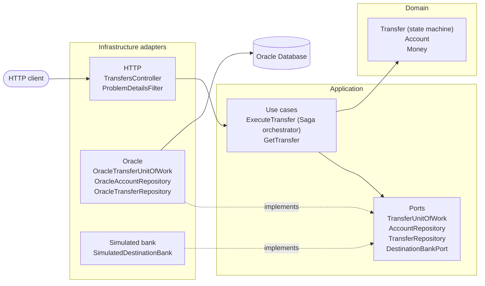
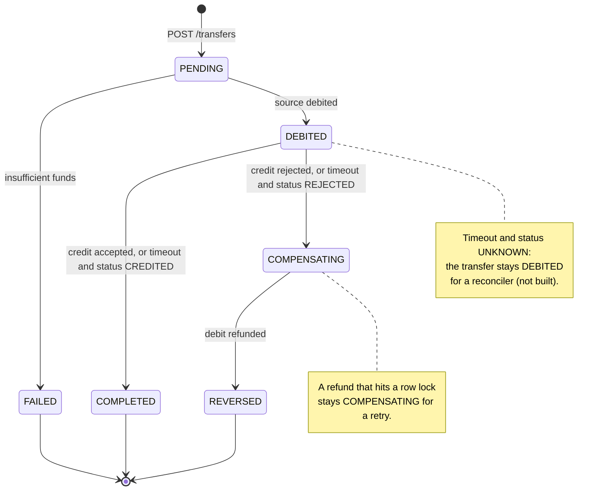

# transfers-saga

[](https://github.com/CristopherReyesP/transfers-saga/actions/workflows/ci.yml)

A NestJS service that moves money from a local Oracle account to an account at another bank, modeled as an orchestrated Saga. It debits the source account, asks an external bank to credit the destination, and refunds the debit when that credit fails. Idempotency keys, `FOR UPDATE NOWAIT` row locks, and a status check after every credit timeout keep the balances correct under client retries, concurrent requests, and an unreliable network.

**Stack:** NestJS 12, TypeScript (strict, ESM), Oracle Database Free 23 through `oracledb` in thin mode (no Instant Client), Vitest, Testcontainers, oxlint.

## What this repo demonstrates

| Concern | How it is handled |
|---------|-------------------|
| Distributed transaction | An orchestrated Saga: debit locally, credit remotely, compensate on failure. The transfer row persists every state. |
| Retries | `POST /transfers` requires an `Idempotency-Key`. A replay returns the same response and never debits twice. |
| Concurrency | `SELECT ... FOR UPDATE NOWAIT` on the source account. A busy row answers `409` with `Retry-After`, never `500`. |
| Unreliable network | A credit timeout is not a failure: the service asks the destination for the real outcome before it compensates. |
| Architecture | Hexagonal layers under a screaming `src/transfers/` folder. The domain imports neither NestJS nor `oracledb`. |
| Errors | Every error is an RFC 9457 `application/problem+json` body with a stable `code`. |
| Tests | Unit specs with in-memory fakes, plus integration and end-to-end suites against a real Oracle in Testcontainers. |

The destination account lives at another bank on purpose. If both accounts sat in the same database, one local ACID transaction would do the job and a Saga would be over-engineering.

## Architecture

Dependencies point inward: adapters implement the application ports, and the domain depends on nothing.



### Saga states



How `ExecuteTransfer` runs one transfer:

1. **One local transaction:** lock the source row (`NOWAIT`), debit it, and insert the transfer as `DEBITED` together with its idempotency key. `PENDING` only exists in memory, so a crash can never leave money debited while the transfer reads `PENDING`. Insufficient funds commit the transfer as `FAILED` instead.
2. **Outside any transaction:** call `DestinationBankPort.credit` with the transfer id as the reference.
3. **One transaction per state change:** `COMPLETED`, or `COMPENSATING` followed by the refund and `REVERSED`.

## Quickstart

You need Docker with Compose v2.

```sh
docker compose up --build
```

Compose starts Oracle Database Free, creates the schema from [`schema.sql`](src/transfers/infrastructure/oracle/schema.sql) in the `saga` schema, seeds two accounts from [`db/seed.sql`](db/seed.sql), and starts the API on <http://localhost:3000> once Oracle is healthy. The first run pulls the Oracle image, which takes a while; later starts take seconds.

| Account | Balance | Use |
|---------|---------|-----|
| `source-1` | 100000 minor units (1,000.00 USD) | Every simulated-bank outcome |
| `low-balance-1` | 500 minor units (5.00 USD) | The insufficient-funds case |

The simulated destination bank picks its behavior from the prefix of `destinationAccount`:

| `destinationAccount` prefix | Simulated bank | Resulting `status` | Source balance |
|-----------------------------|----------------|--------------------|----------------|
| anything else | credits | `COMPLETED` | debited |
| `reject-` | rejects the credit | `REVERSED` | refunded |
| `timeout-credited-` | times out, then reports `CREDITED` | `COMPLETED` | debited |
| `timeout-rejected-` | times out, then reports `REJECTED` | `REVERSED` | refunded |
| `timeout-unknown-` | times out, then reports `UNKNOWN` | `DEBITED` | debited, awaiting reconciliation |

Run the calls below from a second terminal. Response bodies are formatted here for reading; the ids are generated, so yours will differ.

### Credited

```sh
curl -i http://localhost:3000/transfers \
  -H 'Content-Type: application/json' \
  -H 'Idempotency-Key: demo-credited-1' \
  -d '{"sourceAccountId":"source-1","destinationAccount":"dest-100","amount":{"minorUnits":2500,"currency":"USD"}}'
```

```http
HTTP/1.1 201 Created
Location: /transfers/64f70b2e-0467-4cf3-9502-e2cf4b3b86e0
Content-Type: application/json; charset=utf-8

{
  "id": "64f70b2e-0467-4cf3-9502-e2cf4b3b86e0",
  "status": "COMPLETED",
  "sourceAccountId": "source-1",
  "destinationAccount": "dest-100",
  "amount": { "minorUnits": 2500, "currency": "USD" }
}
```

Fetch it by the id from the `Location` header:

```sh
curl -i http://localhost:3000/transfers/64f70b2e-0467-4cf3-9502-e2cf4b3b86e0
```

The answer is `200 OK` with the same body.

### Replay

Send the first request again, with the same key and the same payload. The answer is `201` with an identical body (same `id`), and `source-1` is not debited a second time.

```sh
curl -s http://localhost:3000/transfers \
  -H 'Content-Type: application/json' \
  -H 'Idempotency-Key: demo-credited-1' \
  -d '{"sourceAccountId":"source-1","destinationAccount":"dest-100","amount":{"minorUnits":2500,"currency":"USD"}}'
```

The same key with a different payload is refused:

```sh
curl -s http://localhost:3000/transfers \
  -H 'Content-Type: application/json' \
  -H 'Idempotency-Key: demo-credited-1' \
  -d '{"sourceAccountId":"source-1","destinationAccount":"dest-100","amount":{"minorUnits":9900,"currency":"USD"}}'
```

```json
{
  "type": "about:blank",
  "title": "Unprocessable Entity",
  "status": 422,
  "detail": "Idempotency key demo-credited-1 was already used with a different payload",
  "code": "IdempotencyKeyReused"
}
```

### Rejected: `reject-`

```sh
curl -s http://localhost:3000/transfers \
  -H 'Content-Type: application/json' \
  -H 'Idempotency-Key: demo-reject-1' \
  -d '{"sourceAccountId":"source-1","destinationAccount":"reject-dest-200","amount":{"minorUnits":2500,"currency":"USD"}}'
```

```json
{
  "id": "108ee6a0-a957-488d-adef-00e883423f47",
  "status": "REVERSED",
  "sourceAccountId": "source-1",
  "destinationAccount": "reject-dest-200",
  "amount": { "minorUnits": 2500, "currency": "USD" },
  "failureReason": "Destination bank rejected the credit"
}
```

### Timeout, then credited: `timeout-credited-`

```sh
curl -s http://localhost:3000/transfers \
  -H 'Content-Type: application/json' \
  -H 'Idempotency-Key: demo-timeout-credited-1' \
  -d '{"sourceAccountId":"source-1","destinationAccount":"timeout-credited-dest-300","amount":{"minorUnits":2500,"currency":"USD"}}'
```

```json
{
  "id": "f98cb7c8-96de-447e-af59-74f133e4a87b",
  "status": "COMPLETED",
  "sourceAccountId": "source-1",
  "destinationAccount": "timeout-credited-dest-300",
  "amount": { "minorUnits": 2500, "currency": "USD" }
}
```

The credit timed out, but the destination had applied it, so the transfer completes and nothing is refunded.

### Timeout, then rejected: `timeout-rejected-`

```sh
curl -s http://localhost:3000/transfers \
  -H 'Content-Type: application/json' \
  -H 'Idempotency-Key: demo-timeout-rejected-1' \
  -d '{"sourceAccountId":"source-1","destinationAccount":"timeout-rejected-dest-400","amount":{"minorUnits":2500,"currency":"USD"}}'
```

```json
{
  "id": "1e1af5cb-a9fe-42cd-852d-cdc9fe83e822",
  "status": "REVERSED",
  "sourceAccountId": "source-1",
  "destinationAccount": "timeout-rejected-dest-400",
  "amount": { "minorUnits": 2500, "currency": "USD" },
  "failureReason": "Destination rejected the credit"
}
```

### Timeout, outcome unknown: `timeout-unknown-`

```sh
curl -s http://localhost:3000/transfers \
  -H 'Content-Type: application/json' \
  -H 'Idempotency-Key: demo-timeout-unknown-1' \
  -d '{"sourceAccountId":"source-1","destinationAccount":"timeout-unknown-dest-500","amount":{"minorUnits":2500,"currency":"USD"}}'
```

```json
{
  "id": "c6fc66d6-466d-4ee6-bb09-ef319070c235",
  "status": "DEBITED",
  "sourceAccountId": "source-1",
  "destinationAccount": "timeout-unknown-dest-500",
  "amount": { "minorUnits": 2500, "currency": "USD" }
}
```

Nobody knows yet whether the money arrived, so the service neither completes nor refunds. `DEBITED` is not a final state, so replaying this key answers `409`:

```json
{
  "type": "about:blank",
  "title": "Conflict",
  "status": 409,
  "detail": "The transfer for idempotency key demo-timeout-unknown-1 is still in progress",
  "code": "TransferInProgress"
}
```

### Insufficient funds

```sh
curl -s http://localhost:3000/transfers \
  -H 'Content-Type: application/json' \
  -H 'Idempotency-Key: demo-insufficient-1' \
  -d '{"sourceAccountId":"low-balance-1","destinationAccount":"dest-600","amount":{"minorUnits":2500,"currency":"USD"}}'
```

```json
{
  "id": "c1b44297-6eff-4126-965c-67773975bb27",
  "status": "FAILED",
  "sourceAccountId": "low-balance-1",
  "destinationAccount": "dest-600",
  "amount": { "minorUnits": 2500, "currency": "USD" },
  "failureReason": "Debit exceeds the account balance"
}
```

The `FAILED` transfer is persisted, so a replay of this key returns the same answer.

### Unknown transfer

```sh
curl -i http://localhost:3000/transfers/does-not-exist
```

```http
HTTP/1.1 404 Not Found
Content-Type: application/problem+json; charset=utf-8

{
  "type": "about:blank",
  "title": "Not Found",
  "status": 404,
  "detail": "Transfer does-not-exist does not exist",
  "code": "TransferNotFound"
}
```

### Check the balances

```sh
docker compose exec -T oracle sqlplus -s saga/saga@//localhost/FREEPDB1 <<'SQL'
SET TAB OFF
COLUMN id FORMAT A16
SELECT id, balance_minor, currency FROM accounts ORDER BY id;
SQL
```

```text
ID               BALANCE_MINOR CURRENCY
---------------- ------------- ------------
low-balance-1              500 USD
source-1                 92500 USD
```

`source-1` lost 2500 three times (credited, timed out then credited, timed out with an unknown outcome). The two reversals were refunded and the replay debited nothing.

Stop the stack and drop the database with `docker compose down -v`.

## API

### `POST /transfers`

| Part | Rule |
|------|------|
| `Idempotency-Key` header | Required. One value of 1 to 255 visible ASCII characters (`0x21` to `0x7E`). |
| `sourceAccountId` | String, 1 to 64 characters. The local account to debit. |
| `destinationAccount` | String, 1 to 64 characters. The account at the destination bank. |
| `amount.minorUnits` | Positive safe integer in minor units (cents for USD). |
| `amount.currency` | Three uppercase letters, and the same currency as the source account. |
| Any other field | Rejected with `400`. |

The answer is always `201 Created` with a `Location: /transfers/{id}` header and the transfer, replays included. The outcome is in `status`, not in the HTTP code, because a `FAILED` or `REVERSED` transfer is still a transfer that was created.

```json
{
  "id": "string",
  "status": "DEBITED | COMPLETED | COMPENSATING | REVERSED | FAILED",
  "sourceAccountId": "string",
  "destinationAccount": "string",
  "amount": { "minorUnits": 2500, "currency": "USD" },
  "failureReason": "string, only on FAILED, COMPENSATING, and REVERSED"
}
```

### `GET /transfers/{id}`

`200` with the same transfer body, or `404` with `code: TransferNotFound`.

### Idempotency-Key rules

- The key is stored on the transfer row under a unique constraint; there is no separate idempotency store.
- Same key, same payload, final status (`COMPLETED`, `REVERSED`, `FAILED`): `201` with the stored transfer. Nothing is debited again.
- Same key, same payload, transfer still `DEBITED` or `COMPENSATING`: `409 TransferInProgress`.
- Same key, different payload (source, destination, amount, or currency): `422 IdempotencyKeyReused`.
- Two first requests racing with one key: exactly one debits. The other gets `409`, either `AccountLocked` (the winner still holds the row) or `TransferInProgress` (the unique constraint refused its insert and its debit rolled back).
- A request that ended in `400`, `404`, `409 AccountLocked`, or `422 CurrencyMismatch` persisted nothing, so the same key can be retried.

### Status codes

| Status | `code` | When |
|--------|--------|------|
| `201` | | Transfer created or replayed |
| `200` | | `GET` found the transfer |
| `400` | `InvalidIdempotencyKey` | The header is missing, repeated, or malformed |
| `400` | `BadRequestException` | The body fails validation (wrong types, unknown fields) |
| `400` | `InvalidAmount` | The amount is zero, negative, or not a safe integer |
| `400` | `InvalidCurrency` | The currency is not three uppercase letters |
| `404` | `AccountNotFound` | The source account does not exist |
| `404` | `TransferNotFound` | No transfer has that id |
| `404` | `NotFoundException` | Unknown route |
| `409` | `AccountLocked` | Another transaction holds the source row. Sent with `Retry-After: 1` |
| `409` | `TransferInProgress` | The transfer for this key is not final yet |
| `422` | `IdempotencyKeyReused` | The key was used with a different payload |
| `422` | `CurrencyMismatch` | The amount currency differs from the source account's |
| `500` | `InternalServerError` | Anything else. The detail is generic; the log keeps the cause |

### Errors

Every error is an [RFC 9457](https://www.rfc-editor.org/rfc/rfc9457) problem with `Content-Type: application/problem+json`. `code` is the name of the error class, so clients can branch on it without parsing `detail`.

```json
{
  "type": "about:blank",
  "title": "Conflict",
  "status": 409,
  "detail": "Account source-1 is locked by another operation",
  "code": "AccountLocked"
}
```

### Configuration

| Variable | Required | Example |
|----------|----------|---------|
| `ORACLE_USER` | yes | `saga` |
| `ORACLE_PASSWORD` | yes | `saga` |
| `ORACLE_CONNECT_STRING` | yes | `oracle:1521/FREEPDB1` |
| `PORT` | no, defaults to `3000` | `3000` |

The service refuses to start when an Oracle variable is missing.

## Design decisions

### 1. Orchestration over choreography

- **Context:** a transfer spans the local database and another bank, and its compensation depends on how the credit failed. Someone has to know the current step.
- **Decision:** one orchestrator, `ExecuteTransfer`, drives the steps through ports and persists the Saga state on the transfer row after every step.
- **Consequences:** the whole flow reads top to bottom in one file, `GET /transfers/{id}` shows where a transfer stands, and unit tests cover every branch with in-memory fakes. The cost is a central coordinator: if the process dies mid-Saga, the persisted state says where to resume, but nothing resumes it yet (see [Known limits](#known-limits)). Choreography would decouple the steps through events, at the price of a broker, an outbox, and a flow scattered across handlers, which is too much for one service.

### 2. `NOWAIT` over `WAIT` for the row lock

- **Context:** the debit needs an exclusive lock on the source row to avoid lost updates. With a plain `FOR UPDATE`, a second transfer from the same account blocks, holding a pooled connection and an HTTP request for as long as the first one takes.
- **Decision:** `SELECT ... FOR UPDATE NOWAIT`. Oracle answers `ORA-00054` at once; the adapter maps it to `AccountLocked`, the transaction rolls back, and the API answers `409` with `Retry-After: 1`.
- **Consequences:** latency stays bounded and the connection pool cannot pile up behind one hot account. Clients must retry on `409`, which is safe because nothing was persisted and the same key can be reused. The refund takes the same lock, so a refund that loses the race leaves the transfer `COMPENSATING`. `WAIT n` would be the middle ground if contention were routine.

### 3. Timeout ≠ failure

- **Context:** a credit timeout does not say whether the other bank applied the credit. Refunding blindly can pay the money twice (once at the destination and once back to the source).
- **Decision:** on `CreditTimeout`, ask `DestinationBankPort.getCreditStatus(reference)` before acting. The transfer id is the reference, and credits are idempotent by reference. `CREDITED` completes the transfer, `REJECTED` compensates it, and `UNKNOWN` leaves it `DEBITED`.
- **Consequences:** no refund of a credit that landed and no double reversal. The price is money in flight: an `UNKNOWN` transfer stays `DEBITED`, and its key answers `409`, until a reconciler resolves it.

### 4. The idempotency key lives on the transfer

- **Context:** `POST /transfers` must be safe to retry. A separate idempotency store (another table or a cache) would need its own consistency with the debit and the transfer.
- **Decision:** store the key in `transfers.idempotency_key` under a unique constraint, inserted in the same local transaction as the debit. A replay loads the transfer by key and compares the payload.
- **Consequences:** the key, the debit, and the transfer commit or roll back together, and a race between two first requests is settled by the constraint (`ORA-00001` on `TRANSFERS_IDEMPOTENCY_KEY_UK`), which rolls the loser's debit back. There is no extra infrastructure. On the other hand, a key is bound to its transfer forever (no expiry), and a replay rebuilds the response from the stored transfer instead of caching the HTTP response.

## Testing

| Command | Runs | Docker |
|---------|------|--------|
| `npm test` | Unit specs (`*.spec.ts`): domain, orchestrator with in-memory fakes, filter, header parser, simulated bank | no |
| `npm run test:int` | Integration specs (`*.int-spec.ts`): the Oracle adapters, `NOWAIT` conflicts, rollbacks, the Saga on a real database | yes |
| `npm run test:e2e` | End-to-end specs (`test/*.e2e-spec.ts`): the real `AppModule` over HTTP, including concurrent requests with one key | yes |
| `npm run lint` | oxlint with type-aware rules | no |
| `npm run build` | `nest build` | no |

The integration and end-to-end suites start one `gvenzl/oracle-free:23-slim-faststart` container per run through Testcontainers and apply `schema.sql`. CI runs all of the above, plus `npx tsc -p tsconfig.json --noEmit`, on every push to `main` and every pull request.

## Project layout

```text
src/
  main.ts                     Bootstrap: PORT, shutdown hooks
  app.module.ts
  transfers/
    domain/                   Money, Account, Transfer (state machine), domain errors
    application/              ExecuteTransfer (Saga orchestrator), GetTransfer, errors
      ports/                  TransferUnitOfWork, AccountRepository, TransferRepository, DestinationBankPort
      testing/                In-memory fakes for the unit specs
    infrastructure/
      http/                   Controller, DTO, Idempotency-Key parser, problem-details filter
      oracle/                 schema.sql, unit of work, repositories, ORA error mapping
      simulated-bank/         SimulatedDestinationBank
    transfers.module.ts       Nest wiring: ports bound to adapters
test/
  oracle/                     Testcontainers global setup and database helpers
  http/                       App factory for the end-to-end specs
  *.e2e-spec.ts
db/
  init/                       Compose init script: schema.sql and the seed, as the app user
  seed.sql                    Demo accounts
Dockerfile                    Multi-stage build, non-root runtime
docker-compose.yml            Oracle Database Free and the API
.github/workflows/ci.yml      Lint, build, type-check, unit, integration, end-to-end
```

## Known limits

- **No reconciler.** Transfers left `DEBITED` (timeout with an unknown outcome) or `COMPENSATING` (the refund hit a lock, or the process stopped mid-Saga) stay there, and their keys answer `409`. A background job that re-queries the destination and retries refunds would close the loop.
- **The simulated bank is a toy.** It keeps every outcome in an unbounded in-memory map, which grows with each transfer and is lost on restart. After a restart it answers `UNKNOWN` for older references.
- **No authentication or authorization.** Anyone who reaches the API can move money from any account.
- **One currency per transfer.** The amount must be in the source account's currency; there is no FX.
- **Idempotency keys never expire.**

## License

[MIT](LICENSE) © 2026 Cristopher Reyes
